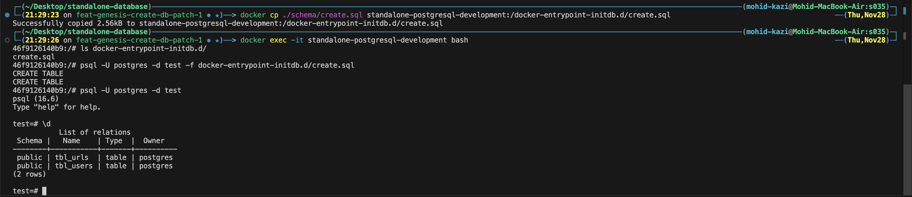
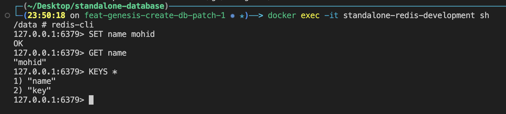
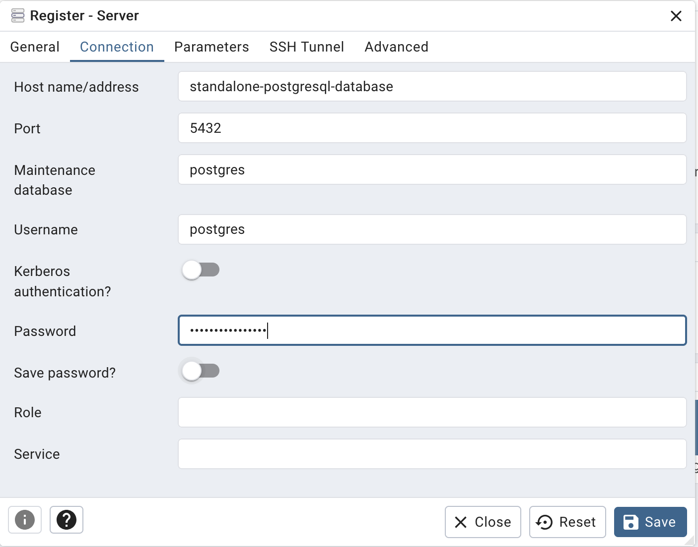

# Standalone Database


## Table of content
- [Purpose](#purpose)
- [Postgresql Redis](#postgres-redis)
  - [Project structure](#project-structure)
- [Installation](#installation)
- [Configuration](#configuration)
  - [Setup Environment](#setup-environment)
  - [Setup Docker](#setup-docker) 
- [Deploy](#deploy)
  - [Misc](#miscellaneous)
  - [Add Postgres to pgAdmin](#add-postgres-to-pgadmin)
- [Bonus](#bonus)
- [Reference](#reference)

## Purpose
This repo contains the Datalayer which is agnostic of Service layer. The purpose of creating a Standalone Data layer is to **DECOUPLE** it from Application or Service layer, so that we can plug it to any backend or deploy it separately without being tied by our Backend Service.

## Postgres Redis
This example provides a base setup for using [PostgreSQL](https://www.postgresql.org/) and [pgAdmin](https://www.pgadmin.org/) and [redis](https://redis.io/). 

> [!Tip]
> More details on how to customize the installation and the compose file can be found here [PostgreSQL](https://hub.docker.com/_/postgres) here [pgAdmin](https://hub.docker.com/r/dpage/pgadmin4/) and here [redis](https://hub.docker.com/_/redis).

### Project structure
```
.
├── docker-script
    ├── psql.sh
├── schema
    ├── create.sql
├── public
    ├── ... // contains resources or media
├── .env
├── compose.yaml
└── README.md
```

## Installation
If you dont already have docker installed on your system, head out to their [website](https://www.docker.com/get-started/). Installing docker nowadays is pretty straightforward.
Now to check if docker has been installed, run this command from the terminal
```shell
$ docker -v
```
To check whether docker is running as expected, we run following command
```shell
$ docker run hello-world
```
> [!Note]
> refer the [hellow-world](https://hub.docker.com/_/hello-world) image description


## Configuration
### Setup Environment
Before running our docker container, we need to configure our environment variables. i have created `.env.example` with dummy value, run below command from root directory
```shell
$ cp .env.example .env
```
This command will create a `.env` file in the root directory, now you can update the variables with real credentials.

> [!Note]
> **do not add real credentials in `.env.example` file**

### Setup Docker
In this block, i will focus on postgres docker setup, as the steps are similar across docker packages.

The easiest way to containerize an application (start a postgresql instance) is by using `docker run`, e.g
```shell
$ docker run --name some-postgres -e POSTGRES_PASSWORD=mysecretpassword -d postgres
```
Another approach is to create `Dockerfile` or `compose.yaml` file, now there are 2 ways we can achieve this
We can either write the docker config manually, for which we can follow the [postgres](https://hub.docker.com/_/postgres) description from [docker hub](https://hub.docker.com).

Or we can use `docker init` command which will create the config based on the repo environment.

> [!Note]
> When i used `docker init` for a backend nodejs project, i had to manually change few things to get it working properly.

## Deploy
Now we can finally start running the docker application. We will use [docker compose](https://docs.docker.com/reference/cli/docker/compose/up/) command to run multiple services with single command.

```bash
docker compose up
```
> [!Tip]
> For linux system, if you run above command as is, you will get `permission denied` error, To resole this issue, you will need to run the docker command using `sudo`.

### Miscellaneous
Now that everything is working as expected, we will move on to next step
- To access postgres database, you can use psql command which i have provided in `docker-script`
  - First we need to make the file executable by running `chmod +x ./docker-script/psql.sh`
  - Run the command from terminal `./docker-script/psql.sh`
- We have created database, but without table we cannot do much, so now we need to create table, there are a few ways to achieve this.
  - You can copy the query from `schema/create.sql` file, psql into database and paste the query and run it
  - Or you can use `docker cp` to first copy the `sql` file inside the postgresql container, then use `docker exec` to access postgres container terminal and - - - check if the file has been copied successfully. lastly use `psql` command to run the query.
  ```bash
    $ docker cp ./schema/create.sql <container-name>:/docker-entrypoint-initdb.d/create.sql;
    $ docker exec <container-name> bash
  ```
  

  - You might have noticed we have used [pg_stat_statements](https://www.postgresql.org/docs/current/pgstatstatements.html) in our compose file, as per their website
    > The pg_stat_statements module provides a means for tracking planning and execution statistics of all SQL statements executed by a server.
  - To learn more about how to use `pg_stat_statements`, you can check this [blog](https://www.crunchydata.com/blog/tentative-smarter-query-optimization-in-postgres-starts-with-pg_stat_statements).
- Docker does not persiste any data, what that means in that once we stop the docker container, all the data from our database will be lost. For this, we will use [volumes](https://docs.docker.com/engine/storage/volumes/).
> Volumes are the preferred mechanism for persisting data generated by and used by Docker containers
```yaml
volumes:
  - .data/postgres:/var/lib/postgresql/data
```
- To access redis database, you can use `redis-cli` command. Follow below command.


### Add postgres to pgAdmin
After logging in with your credentials of the .env file, you can add your database to pgAdmin.
1. Right-click "Servers" in the top-left corner and select "Create" -> "Server..."
2. Name your connection
3. Change to the "Connection" tab and add the connection details:
- Hostname: `<container-name>` (this would normally be your IP address of the postgres database - however, docker can resolve this container ip by its name)
- Port: "5432"
- Maintenance Database: $DB_NAME (see .env)
- Username: $DB_USER (see .env)
- Password: $DB_PASSWORD (see .env)

<p align="center">

</p>

## Bonus
Note that when you create a database, its always recommended to create a non root user to access database from application layer.
You can follow below steps to create new database, changing the database, creating user with privileges etc.
To learn more about roles and access, you can check this [post](https://neon.tech/postgresql/postgresql-administration/postgresql-roles) from neon 
```sql
CREATE DATABASE db_sparkling_water_business; --create new database
\c db_sparkling_water_business; --checkout to another database
SELECT current_database(); --check current database
CREATE USER user_admin PASSWORD 'your-password'; --create new user
GRANT ALL ON ALL TABLES IN SCHEMA "public" TO user_admin; --grant access to the user
SELECT CURRENT_USER; --check current user
```
Once you have created new user, make changes in your `.env` file and update `DB_USER` and `DB_PASSWORD` with the credentials you have created.

> [!Important]
> You need to be logged in as superuser to create new user and grant them privileges


## Reference
This post has been inspired by [awesome-compose](https://github.com/docker/awesome-compose/tree/master/postgresql-pgadmin)

To learn more about postgresql, you can check [neon docs](https://neon.tech/postgresql/tutorial)

To learn more about redis command, you can chek their [docs](https://redis.io/docs/latest/commands/)

